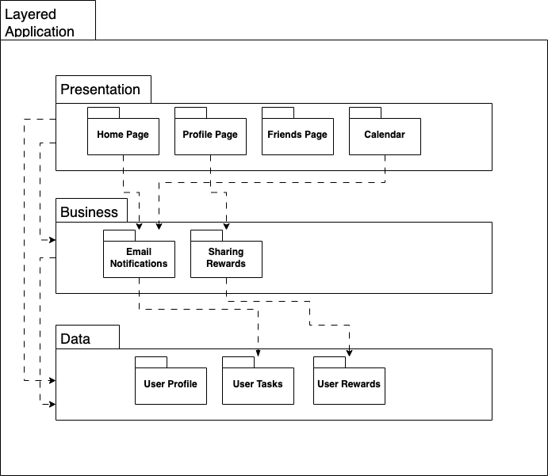
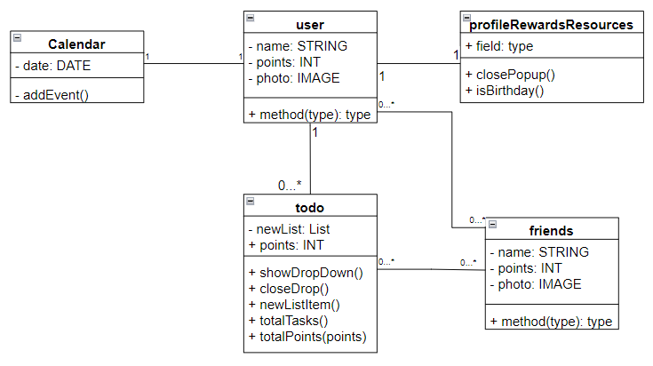
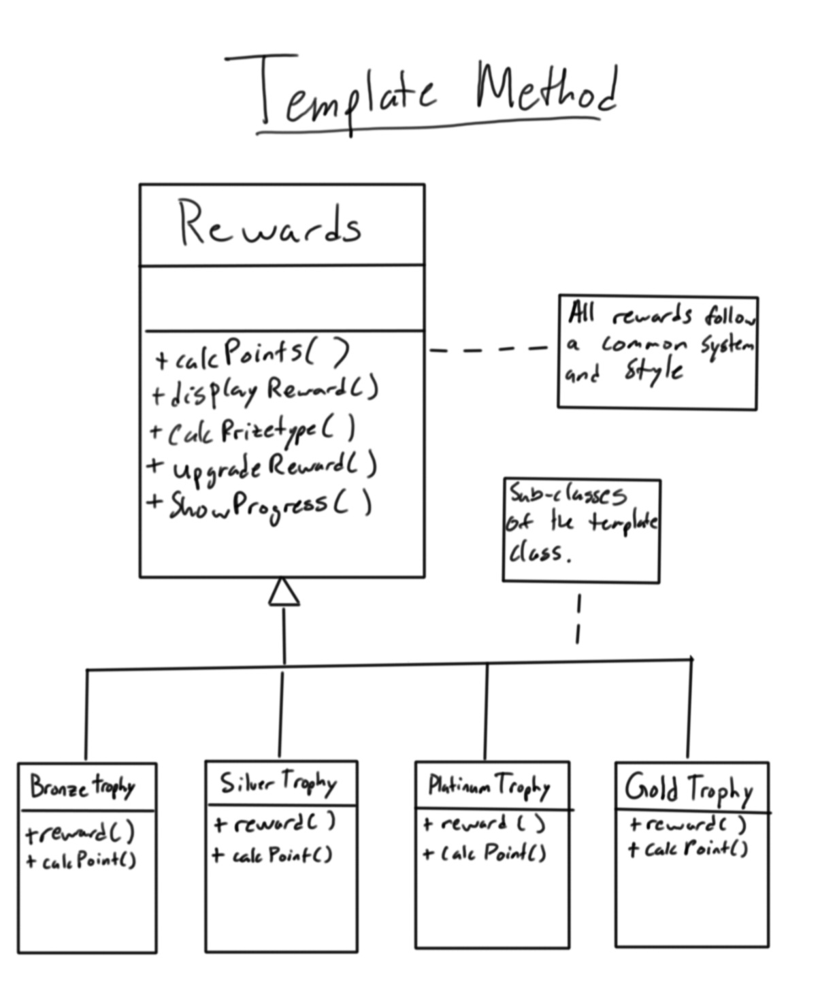

# Deliverable 5 - Project Design

## 1. Description

Every modern college student and working professional has hundreds of tasks to keep track of and complete each month. To stay productive and motivated, one must have a way of organizing these tasks that is simple, concise, and fun to use. Having to switch between different apps or tabs to access one's calendar, to-do list, and notes - or worse, having to flip through pages of a physical planner - is time consuming and anything but enjoyable. SideQuests is an online personal and academic planner that is easy to use, takes up little digital space, and promotes productivity and motivation through rewards.

## 2. Architecture

This archtiecture is based off of UML package diagram for Mulit-Layered Web Application. We chose this architecture because we were able to identify 3 distinct layers to our program. The user interface, the data logic and the data itself. Using these layers the Multi-Layered architecture made the most sense.

## 3. Class Diagram

## 4. Sequence Diagram

## 5. Design Patterns

Classes: https://github.com/cs386-03/SideQuests/tree/main/website/originals

Classes: https://github.com/cs386-03/SideQuests/tree/main/website/originals

## 6. Design Principles

**Single Responsibility Principle:** This is the idea that a class does only one thing and is only affected by changes in one kind of logic. For example, the Task class is only responsible for managing tasks. This class is not affected by logic outside of creating and managing tasks.

**Open-Closed Principle:** This is the idea that classes are open to extension and closed to modification. This means that new functionality can be added to a class without the existing code being modified. While we do not have a current example of this, we will try our best to practice as we implement more.

**Liskov Substitution Principle:** This is the idea that any subclass should be subtitutable for its base class. An example in our project are the classes Task and Shared Task. Any method that expects a Task should work as expected for a Shared Task.

**Interface Segregation Principle:** This is the idea that interfaces should be seperated that serve different purposes, to avoid overcrowding. We are implementing this by having seperate webpages for the Login, Tasks and Calendar, Profile, and Friends.

**Dependency Inversion Principle:** This is the idea that classes should be dependent on abstract classes instead of concrete classes. This allows for better extension of classes. The Task and Shared Task classes are again an example of this. Shared Task is dependent on Task, which is an abstract class.
