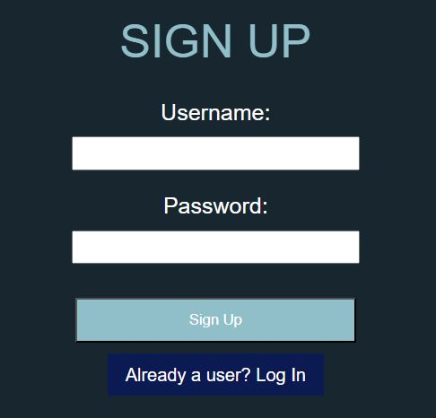
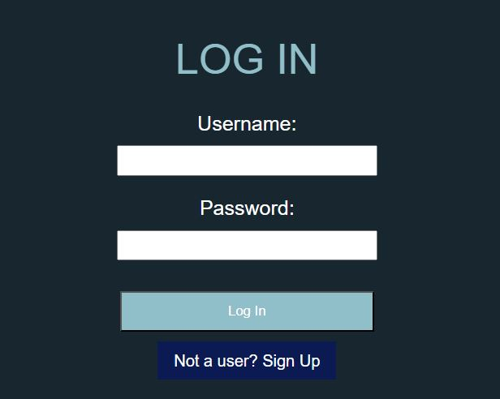
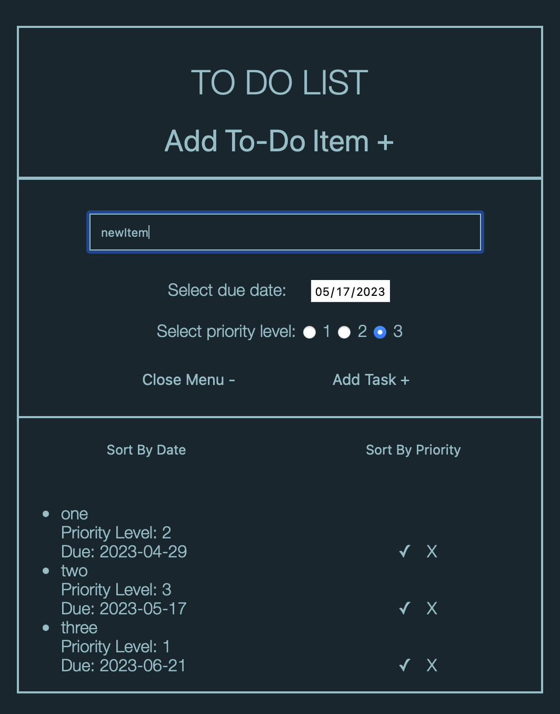
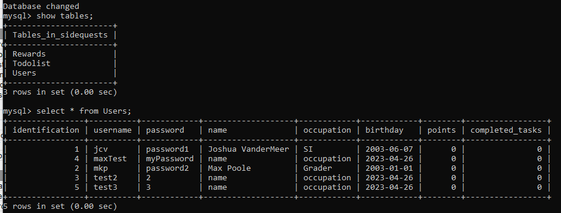
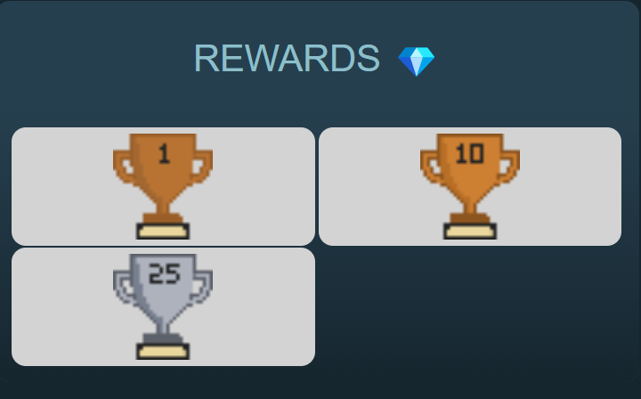
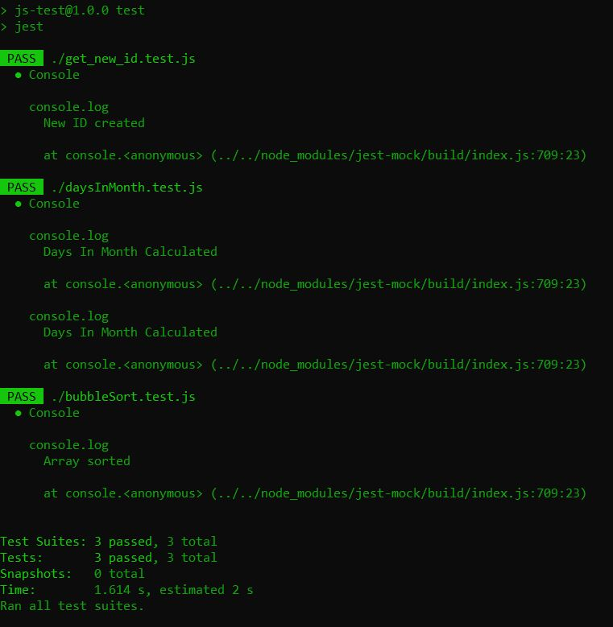

# Deliverable 6 - Second Implementation

## 1. Introduction

SideQuests is an easy to use website that assists in navigating the chaos of life with reminders and rewards, praising you for staying on track. The main features of this product are being able to track your progress and get rewarded for completing tasks. Users have the option of listing tasks and the date that they need to be completed by. Users can also collaborate with their friends on tasks, and see their friends status's. As of right now, the features implemented are as follows. 

There is a calendar on the webpage that shows the current month and highlights the current day. There is a to-do list that users can add tasks to. They are able to specify the date the task should be completed by, as well as the priority that the task has. The user is able to sort the list by due date or by priority. They can also delete the tasks off of the list without completing them. There is also a counter that tracks the number of points a user has earned and display them on the same page as the todo list. The points earned are based on the priority of tasks completed. It also tracks the number of tasks completed. There are pages for the friends list, and the trophies that have been earned. There is also an initial login page. It uses a database to store and access user information.

Github: https://github.com/cs386-03/SideQuests

## 2. Implemented Requirments

**Requirement:** _As a website user, I want a categorized interface with a large calendar so I can make sense of the date and keep myself organized._ \
**Issue:** [Issue #124](https://github.com/cs386-03/SideQuests/issues/124)\
**Pull Request:** [Pull #141](https://github.com/cs386-03/SideQuests/pull/141)\
**Implemented by:** Meaghan Freund\
**Approved By:** Max Poole\
**Print screen:** \

**Requirement:** _As a student, I want to be able to save my data under a login so I can access it on multiple divices._ \
**Issue:** [Issue #131](https://github.com/cs386-03/SideQuests/issues/131)\
**Pull Requests:** [Pull #153](https://github.com/cs386-03/SideQuests/pull/153) [Pull #165](https://github.com/cs386-03/SideQuests/pull/165)\
**Implemented By:** Lauren Farr\
**Approved By:** Josh VanderMeer\
**Print screen:** \

**Requirement:** _As a student, I want to see an organized to-do list by date so that I know what tasks need to be focused on first._ \
**Issue:** [Issue #169](https://github.com/cs386-03/SideQuests/issues/169)\
**Pull Request:** [Pull #142](https://github.com/cs386-03/SideQuests/pull/142)\
**Implemented by:** Max Poole\
**Approved By:** Samantha Madderom\
**Print screen:** \

**Requirement:** _As a student, I want be able to save my data so I can come back and view it later._ \
**Issue:** [Issue #125](https://github.com/cs386-03/SideQuests/issues/125)\
**Pull Request:** [Pull #158](https://github.com/cs386-03/SideQuests/pull/158)\
**Implemented by:** Joshua VanderMeer\
**Approved By:** Lauren Farr\
**Print screen:** \

**Requirement:** _As a website user I want to see what rewards I've earned._\
**Issue:** [Issue #126](https://github.com/cs386-03/SideQuests/issues/126)\
**Pull Request:** [Pull #127](https://github.com/cs386-03/SideQuests/pull/127)\
**Implemented by:** Caden Tedeschi\
**Approved By:** Joshua VanderMeer\
**Print screen:**\

## 3. Tests
**Test Framework:** For our tests, we used the framework Jest, which can be accessed [here](https://jestjs.io/docs/getting-started). \
**Tests Folder:** The folder containing the tests can be accessed [here](https://github.com/cs386-03/SideQuests/tree/main/Tests). It contains the tests from the previous implementation, as well as three new tests. \
**Examples:** One thing we tested is a function that sorts a given array using the Bubble Sort algorithm. This function is used to sort a user's To-Do list items by due date. We also tested a function that generates a new unique ID number, given a list of the existing ID's from the database. It finds the largest ID in the list, adds 1 to it, and returns it, creating a unique ID number. \
**Print screen:** \

## 4. Demo
A demo of the system running can be downloaded [here](https://github.com/cs386-03/SideQuests/blob/main/Demos/Demo2.mov)

## 5. Code Quality

As a team, we kept our code quality neat and readable by organizing by section for the webpage and using descriptive variables to be able to understand each other's code. As our website has different pages, it was necessary to keep the same coding conventions for each page to have a cohesive website. For example, every page has different sections displaying varying subjects, in which we coded using the same manner of separating these components, such as div classes for organization. In addition, we used comments to set apart the portions we worked on or separate ideas in general to be able to read what we each contributed and to reread the each code file with ease. Our comments were written ourselves to provide human descriptions that are easy for us to comprehend, rather than automated comments. As for variables and functions, our functions are named literally on what they do so that there is no confusion and variables have simple yet specific enough names to make it easy to differentiate. If numbers are used for variables, they are used in such a manner that they are necessary and are still readable, given the context of the code. Overall, we kept simple, but descriptive, naming conventions and ensured that our code could be read and understood through comments, especially for others in the group that did not write the code.

## 6. Lessons Learned

For the second implementation we have learned a lot of important lessons for developing a project. We learned how valuable it is to have meetings sooner in the week to collaborate earlier in order to accomplish more work throughout the week. We also learned how beneficial an extra meeting or two can be during a busy week. The more communication we had as a team the more productive we were. We also discovered that assigning individual tasks can limit some communication and that having pairs work on tasks can increase productivity and cause a less frustrating workload. Starting earlier on the deliverables made the project less stressful and more rewarding and we all functioned better as a team this time around. This project has been an eye opening experience for what to expect when building a project from the ground up and how in depth the process can be even outside of just coding. We all think this was a very beneficial experience to have.
