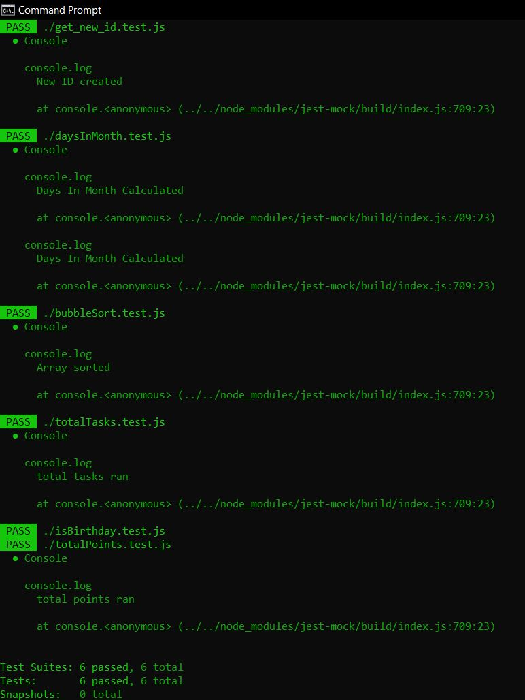

# Deliverable 7 - Project Verification and Validation

## 1. Decription

## 2. Verification

### 2.1 Unit Test
**Test Framework:** For our unit tests, we used the framework Jest, which can be accessed [here](https://jestjs.io/docs/getting-started). \
**Tests Folder:** The folder containing the unit tests can be accessed [here](https://github.com/cs386-03/SideQuests/tree/main/Tests/Unit_Tests). \
**Example:** One example of a unit test containing a mock object is found [here](https://github.com/cs386-03/SideQuests/tree/main/Tests/Unit_Tests/isBirthday.test.js). It creates a mock object of the User class, which contains the user's birthday as an attribute of the user's birthday. It then tests a method that determines whether today is the user's birthday. \
**Print Screen:** \

### 2.2 Acceptance Test
**Test Framework:** For our acceptance tests, we used the fromework Selenium WebDriver, which can be accessed [here](https://www.selenium.dev/documentation/webdriver/). \
**Tests Folder:** The folder containing the acceptance tests can be accessed [here](https://github.com/cs386-03/SideQuests/tree/main/Tests/Acceptance_Tests). \
**Example:** One part of the interface that is tested is the ability for users to add items to the to-do list with a title and priority, and then mark them as complete. The user's total points and completed tasks are then displayed. The code for this test can be found [here](https://github.com/cs386-03/SideQuests/tree/main/Tests/Acceptance_Tests/acceptance_test.py). \
**Demo:** A recording of the automated test running can be downloaded [here](https://github.com/cs386-03/SideQuests/tree/main/Demos/acceptance_demo.mp4). \

## 3. Validation 